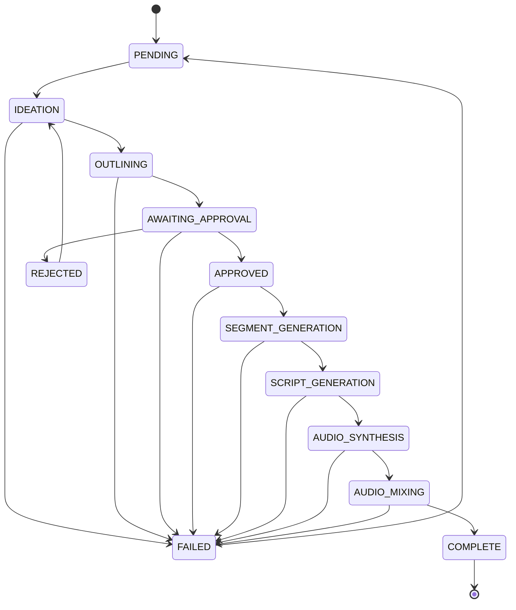

# Pipeline Orchestrator (WP6a)

The **PipelineOrchestrator** coordinates episode generation through an 8-stage
state machine with a human approval gate.

## State Machine



## Flow Overview

1. **`generate_episode(show_id, topic)`** — runs IDEATION → OUTLINING, then
   pauses at AWAITING_APPROVAL and raises `ApprovalRequiredError`.
2. **`ApprovalWorkflow.submit_approval(...)`** — approves or rejects the
   outline. On approval transitions the episode to APPROVED.
3. **`resume_episode(show_id, episode_id)`** — resumes from APPROVED through
   SEGMENT_GENERATION → SCRIPT_GENERATION → AUDIO_SYNTHESIS → AUDIO_MIXING →
   COMPLETE.  Can also resume from intermediate stages after a failure.

### Debug / Selective Re-run

**`execute_single_stage(show_id, episode_id, target_stage)`** runs exactly one
stage without advancing to subsequent stages. Useful for debugging or selective
re-processing.

## Approval Workflow

| Action | Method | Result |
|--------|--------|--------|
| Submit approval | `ApprovalWorkflow.submit_approval(approved=True)` | Episode → APPROVED |
| Submit rejection | `ApprovalWorkflow.submit_approval(approved=False)` | Episode → REJECTED |
| Check timeout | `ApprovalWorkflow.check_approval_timeout()` | Returns True if expired |
| List pending | `ApprovalWorkflow.list_pending_approvals()` | All AWAITING_APPROVAL episodes |

Rejected episodes can be re-run from IDEATION via `generate_episode()`.

## Event System

The orchestrator emits `PipelineEvent` objects through an optional callback:

| Event Type | When |
|-----------|------|
| `stage_started` | Before each stage executes |
| `stage_completed` | After each stage finishes |
| `approval_required` | When the approval gate is reached |
| `approval_submitted` | After approval decision (includes `approved: bool` in data) |

```python
async def my_handler(event: PipelineEvent) -> None:
    print(f"[{event.stage}] {event.event_type}: {event.episode_id}")

orchestrator = PipelineOrchestrator(..., event_callback=my_handler)
```

## Finalization

On successful completion the orchestrator:

1. **Tracks concepts** — calls `ShowBlueprintManager.add_concept()` to record
   the episode topic in `concepts_covered.json`.
2. **Links episode** — calls `ShowBlueprintManager.link_episode()` to register
   the episode directory under the show's `episodes/` folder.

Both operations are wrapped in try/except so a storage failure never prevents
the episode from reaching COMPLETE status.

## Architecture

```
PipelineOrchestrator
├── PromptEnhancer          (context injection, WP6b)
├── IdeationService         (LLM — topic → concept)
├── OutlineService          (LLM — concept → outline)
├── SegmentGenerationService (LLM — outline → segments)
├── ScriptGenerationService (LLM — segments → scripts)
├── AudioSynthesisService   (TTS — scripts → audio files)
├── AudioMixer              (audio — segments → final mp3)
├── ShowBlueprintManager    (CRUD for show data)
└── EpisodeStorage          (persistence for episode state)
```

All services are injected via constructor, making the orchestrator fully
testable with mocks.
